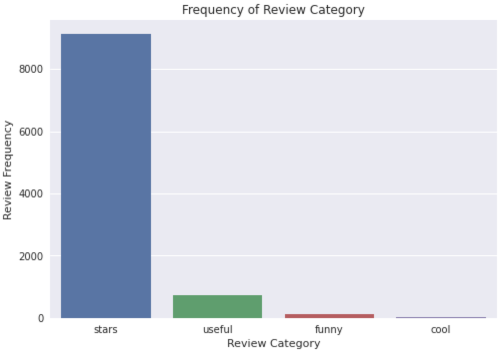

# Yelp Reviews Project

This project seeks to build a model that can succesfully classify a yelp review into one of four categories. Due to major class imbalance, 3 categories were combined into one to make a binary model. Therefore, the scope of the project was reframed to seek to classify if a yelp review would receive a star or not.

The previous chart shows the class imbalance encounterd.

## Processing Data
The following approach was taken to process data before modeling:
- Punctuation was removed.
- Stop words were removed.
- Reviews were lemmatized.
- Reviews was vectorize using term frequency inverse document frequency.  
[see pipeline](pipelines/classification_model_train.py)

## Modeling Data
Due to hardware limitations, a dataset of 3 million was used to fit a complement naive bayes model. To close the class imbalance gap, a strategy of random over and under sampling was used. [see Jupyter Notebook](EDA_modelling/classification.ipynb) and [pipeline](pipelines/classification_model_train.py).

## Results
- F1 Score: .83
- Recall: .74
- Precision: .93
- Accuracy: .74